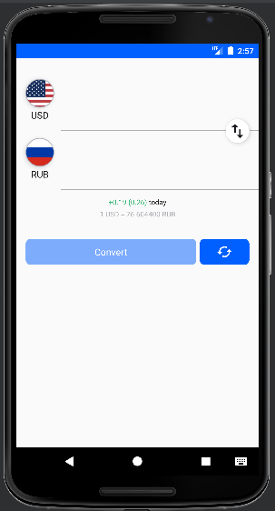

# Конвертор валют
## Среда разработки
- Android Studio Electric Eel | 2022.1.1 Patch 2
## Требования программы
### Среда исполнения
- мобильные телефоны и планшеты с ОС Android API 26 (Oreo).
### Сеть
Программе необходим доступ к интернету (http).

## Назначение программы
- Конвертация пар валют. 
Программа позволяет выбрать пары валют из списка валют (нажать на значок с валютой). 
В верхней строке нужно ввести колество валюты из которую нужно конвертировать.
После ввода суммы нужно нажать кнопку конвертировать.
Во второй строке будет результат конвертации. Курс валюты берётся с сервера в интернете.
Внешний вид программы: 
